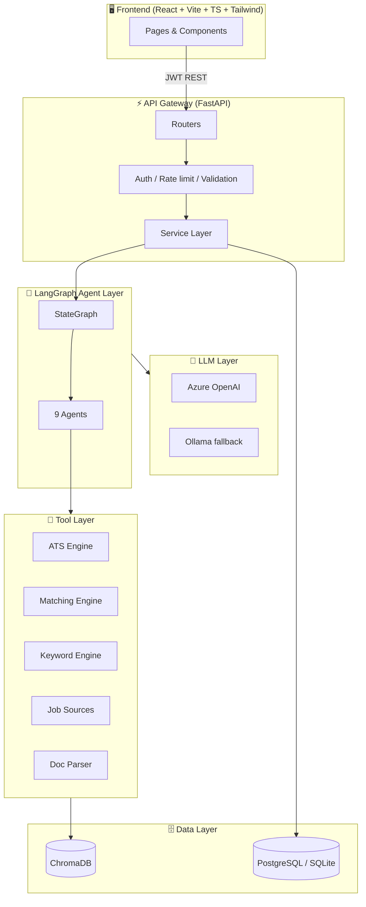

# � TalentTrail

> **"Cursor for Job Hunting"** — an autonomous multi-agent career assistant that discovers jobs, analyzes resumes, optimizes ATS scores, finds missing keywords, generates tailored resumes & cover letters, tracks applications, and builds a personalized career roadmap.

Built as a startup-grade MVP with **LangGraph multi-agent orchestration**, **FastAPI**, **React + TypeScript**, and **Azure OpenAI**.

---

## ✨ Features

| Feature | Description |
| --- | --- |
| 📄 Resume parsing | Upload PDF / DOCX / TXT → structured Resume JSON (skills, projects, education, experience) |
| 🔎 Multi-source job discovery | Pluggable provider layer: Greenhouse, Lever, Ashby, Wellfound, LinkedIn-style ingestion, company pages |
| 🧠 Semantic matching | 4-stage weighted ranking (keyword + semantic + ATS + recency) |
| 📊 Explainable ATS scoring | Transparent 0–100 score with per-factor breakdown |
| 🧩 Missing-keyword analysis | Categorised gaps (skills / technologies / frameworks / tools) ranked by importance |
| ✍️ Resume optimization | ATS-friendly bullet rewrites — never hallucinates experience |
| 💌 Cover letter generator | Tone adapts to Startup / FAANG / Enterprise / AI company |
| 🗺️ Career roadmap | 30/60/90-day plan: roles, skills, projects, certifications |
| 📌 Application tracker | Kanban board across 8 stages with funnel analytics |
| 📈 Analytics dashboard | Applications over time, interview/offer rates, skill gaps, source performance (Recharts) |

---

## 🏗️ Architecture



See **[docs/SYSTEM_DESIGN.md](docs/SYSTEM_DESIGN.md)**, **[docs/AGENT_ARCHITECTURE.md](docs/AGENT_ARCHITECTURE.md)**, **[docs/DATABASE_DESIGN.md](docs/DATABASE_DESIGN.md)**, and **[docs/API_REFERENCE.md](docs/API_REFERENCE.md)** for deep dives with sequence diagrams.

---

## 🧱 Tech Stack

**Backend** Python 3.12 · FastAPI · LangGraph · LangChain · Pydantic v2 · SQLAlchemy 2
**AI** Azure OpenAI (primary) · Ollama / Llama 3 / Mistral (documented fallback) · embeddings
**Vector DB** ChromaDB **DB** PostgreSQL (prod) / SQLite (dev)
**Frontend** React 18 · Vite · TypeScript · Tailwind · Recharts · React Router
**Auth** JWT (access + refresh) · OAuth-ready **DevOps** Docker · Docker Compose · GitHub Actions

---

## 🚀 Quick Start

### Prerequisites
- Python **3.12+**, Node **20+**
- An **Azure OpenAI** resource with a chat deployment (you have these)

### 1. Backend

```bash
cd backend
python3.12 -m venv .venv && source .venv/bin/activate
pip install -r requirements.txt

cp .env.example .env
# Edit .env and set:
#   AZURE_OPENAI_API_KEY=...
#   AZURE_OPENAI_ENDPOINT=https://<resource>.openai.azure.com/
#   AZURE_OPENAI_DEPLOYMENT=<your chat deployment name>
#   (optional) AZURE_OPENAI_EMBEDDING_DEPLOYMENT=<embeddings deployment>

uvicorn app.main:app --reload
```

API → http://localhost:8000 · Interactive docs → http://localhost:8000/docs

> A demo user is auto-seeded: **demo@talenttrail.dev / demo1234**

### 2. Frontend

```bash
cd frontend
npm install
cp .env.example .env        # VITE_API_BASE_URL defaults to localhost:8000
npm run dev
```

App → http://localhost:5173

### 3. Docker (everything)

```bash
cp backend/.env.example backend/.env   # fill Azure keys
docker compose up --build
```

---

## ⚙️ Azure OpenAI configuration

This project uses Azure OpenAI by default. Only three variables are required:

```env
LLM_PROVIDER=azure
AZURE_OPENAI_API_KEY=your-key
AZURE_OPENAI_ENDPOINT=https://your-resource.openai.azure.com/
AZURE_OPENAI_DEPLOYMENT=gpt-4o-mini     # your azure.openai.deployment name
```

If `AZURE_OPENAI_EMBEDDING_DEPLOYMENT` is left blank, the app uses a built-in
deterministic embedder so semantic features still work offline. To switch to
local models set `LLM_PROVIDER=ollama`.

> **The app degrades gracefully**: every LLM call has a deterministic fallback, so the full pipeline runs even without valid credentials (useful for demos/tests).

---

## 🧪 Testing

```bash
# Backend (pytest + coverage)
cd backend && source .venv/bin/activate && pytest

# Frontend (vitest + RTL)
cd frontend && npm test
```

Current status: **13 backend tests passing (~79% coverage)**, frontend component tests passing.

---

## 📁 Project Structure

```
talenttrail/
├── backend/
│   ├── app/
│   │   ├── agents/        # 9 LangGraph agents + state + graph
│   │   ├── api/v1/        # routers + endpoints + deps
│   │   ├── core/          # config, llm factory, security, logging
│   │   ├── db/            # models, session, init/seed
│   │   ├── services/      # service layer (orchestration + persistence)
│   │   ├── tools/         # ATS, matching, keyword, job-source engines
│   │   ├── vector/        # ChromaDB store + chunking
│   │   ├── schemas.py     # Pydantic contracts
│   │   └── main.py        # FastAPI app
│   ├── tests/             # unit + integration + agent tests
│   └── Dockerfile
├── frontend/
│   ├── src/
│   │   ├── components/    # JobCard, ATSScoreCard, ApplicationBoard, charts…
│   │   ├── pages/         # 11 pages
│   │   ├── context/       # AuthContext
│   │   └── lib/api.ts     # typed API client
│   └── Dockerfile
├── docs/                  # SYSTEM_DESIGN, AGENT_ARCHITECTURE, DATABASE_DESIGN, API_REFERENCE, CONTRIBUTING
├── .github/workflows/     # CI
└── docker-compose.yml
```

---

## 🖼️ Screenshots

> _Placeholders — capture after running locally._

| Dashboard | ATS Analysis | Application Tracker |
| --- | --- | --- |
| `docs/screenshots/dashboard.png` | `docs/screenshots/ats.png` | `docs/screenshots/tracker.png` |

---

## 🔐 Security

JWT auth · per-IP rate limiting (slowapi) · file-upload validation (type + size) · Pydantic input validation at every boundary · prompt-injection-resistant agent prompts · non-root Docker user · secrets via env only. See [docs/SYSTEM_DESIGN.md](docs/SYSTEM_DESIGN.md#security).

---

## 📜 License

MIT — see [LICENSE](LICENSE).
