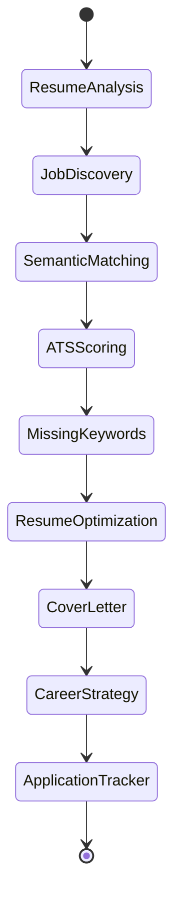

# Agent Architecture

The system is a **LangGraph `StateGraph`** of 9 cooperating agents. Each agent is a
pure node: it receives the shared `TalentTrailState`, returns a partial dict, and
LangGraph merges it back. A `track()` decorator records timing/status into
`execution_history` for every node.

## Shared state (`TalentTrailState`)

| Field | Type | Set by | Purpose |
| --- | --- | --- | --- |
| `user_id` | int | caller | ownership / authz / persistence |
| `job_query`, `location` | str | caller | search intent |
| `target_job_id` | int? | caller | focus job for single-job flows |
| `company_type` | str | caller | cover-letter tone |
| `resume_data` | dict | Resume Analysis | structured Resume JSON |
| `jobs_found` | list | Job Discovery | deduped postings |
| `ranked_jobs` | list | Semantic Matching | jobs + scores (sorted) |
| `ats_scores` | dict | ATS Scoring | explainable 0–100 breakdown |
| `missing_keywords` | dict | Missing Keyword | categorised gaps |
| `optimized_resume` | dict | Optimization | rewritten bullets/summary |
| `cover_letters` | dict | Cover Letter | letter keyed by job id |
| `recommendations` | dict | Career Strategy | roadmap + pipeline analytics |
| `applications` | list | Tracker | application records |
| `execution_history` | list (reducer `+`) | all | per-agent trace |
| `errors` | list (reducer `+`) | all | non-fatal errors |

The `Annotated[list, add]` reducers let every node *append* to history/errors
without overwriting prior entries — this is the idiomatic LangGraph pattern for
accumulating channels.

## The nine agents

### 1. Resume Analysis (`resume_agent.py`)
LLM extracts `{name, summary, skills, education, experience, projects, ...}`.
Deterministic skill extraction (curated lexicon) is merged in as a backstop so
output is never empty. **Guardrail:** prompt forbids inventing experience.

### 2. Job Discovery (`job_discovery_agent.py`)
Calls the `job_sources` abstraction (Greenhouse/Lever/Ashby/Wellfound/LinkedIn/
career pages), aggregates, deduplicates by `external_id`, and tags a coarse
category. Providers implement a common `JobProvider.search()` interface
(Dependency Inversion) so real integrations drop in without agent changes.

### 3. Semantic Matching (`matching_agent.py`)
Runs the 4-stage weighted engine and attaches each job reference to its scores.

### 4. ATS Scoring (`ats_agent.py`)
Resolves the target job (explicit `target_job_id` → top ranked → first found)
and produces the explainable breakdown.

### 5. Missing Keyword (`keyword_agent.py`)
Categorises missing terms (skills/technologies/frameworks/tools), ranked by
frequency in the JD (importance proxy).

### 6. Resume Optimization (`optimization_agent.py`)
Rewrites bullets/summary tailored to the job and weaves in genuinely-held
missing keywords. **Guardrail:** never fabricates roles, employers, or metrics.

### 7. Cover Letter (`cover_letter_agent.py`)
Tone adapts to company archetype (startup/faang/enterprise/ai). Returns
PDF-ready plain text.

### 8. Career Strategy (`strategy_agent.py`)
Synthesises resume + in-demand skills from matched jobs into target roles,
skills to learn, projects, certifications, and a 30/60/90-day roadmap.

### 9. Application Tracker (`tracker_agent.py`)
Derives funnel analytics (interview rate, offer rate) from the application list.

## Graph topology

Two compiled graphs:

- **`build_graph()`** — full pipeline (Resume → Discovery → Matching → ATS →
  Keywords → Optimization → Cover Letter → Strategy → Tracker).
- **`build_analysis_graph()`** — lean single-job flow (ATS → Keywords →
  Optimization → Cover Letter) for when a resume + target job already exist.

## Resilience pattern

`base.py` provides:

- `track(name)` — times the node, captures exceptions, and converts failures
  into recorded errors instead of crashing the graph.
- `llm_json(system, user, fallback=…)` — structured LLM call with fenced-JSON
  extraction and a validated fallback.
- `llm_text(system, user, fallback=…)` — free-text variant.

Because of these, a malformed/unavailable LLM response degrades to a deterministic
result rather than a 500.
