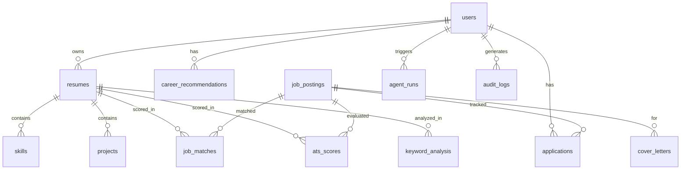

# Database Design

ORM: SQLAlchemy 2 (typed `Mapped[...]`). Dev = SQLite, Prod = PostgreSQL (same
models, switched by `DATABASE_URL`). JSON columns hold semi-structured agent
output so the schema stays stable while LLM output evolves.

## ER diagram



## Tables

| Table | Key columns | Notes / indexes |
| --- | --- | --- |
| `users` | id (PK), email (uniq, idx), hashed_password, oauth_provider | auth root |
| `resumes` | id (PK), user_id (FK,idx), **version**, is_active, raw_text, parsed(JSON) | version history; one active per user |
| `skills` | id (PK), resume_id (FK,idx), name (idx), category | denormalised for fast skill queries |
| `projects` | id (PK), resume_id (FK,idx), tech_stack(JSON) | |
| `job_postings` | id (PK), external_id (idx), source (idx), title (idx), company (idx), description, skills(JSON), posted_at | dedup on external_id |
| `job_matches` | id (PK), user_id/resume_id/job_id (FK,idx), keyword/semantic/ats/recency/**final_score (idx)**, explanation(JSON) | ranking analytics |
| `ats_scores` | id (PK), user/resume/job (FK,idx), 5 sub-scores, total_score (idx), breakdown(JSON) | explainable history |
| `keyword_analysis` | id (PK), user/resume/job (FK,idx), missing(JSON), present(JSON) | gap snapshots |
| `applications` | id (PK), user_id/job_id (FK,idx), **status (Enum,idx)**, applied_at | Kanban board |
| `cover_letters` | id (PK), user_id/job_id (FK,idx), company_type, content | generated letters |
| `career_recommendations` | id (PK), user_id (FK,idx), target_roles/skills/projects/certs(JSON), roadmap(JSON) | strategy snapshots |
| `agent_runs` | id (PK), user_id (FK,idx), graph (idx), status, execution_history(JSON), duration_ms | observability |
| `audit_logs` | id (PK), user_id (FK,idx), action (idx), detail(JSON), ip_address | security audit |

## Enums

- **ApplicationStatus**: `saved · applied · oa · interview · final_round · offer · rejected · withdrawn`
- **JobSource**: `linkedin · greenhouse · lever · ashby · wellfound · career_page · manual`

## Indexing & optimization strategy

- Every FK is indexed (join + filter performance).
- `job_matches.final_score`, `ats_scores.total_score`, `applications.status`
  indexed — these drive the dashboard's hot queries (top recommendations, board
  columns, analytics).
- `job_postings.external_id` indexed for O(log n) dedup lookups during ingestion.
- JSON columns avoid schema churn; when a field becomes query-critical it is
  promoted to a real column (as done for skills via the `skills` table).
- Cascade rules: deleting a user/resume cascades to dependent rows;
  `ON DELETE SET NULL` where history should survive job deletion.

## Migrations

Alembic is included (`alembic` in requirements). For the demo, tables are created
on startup via `init_db()` which also seeds a demo user + sample jobs. For
production, generate versioned migrations:

```bash
alembic init alembic   # one-time
alembic revision --autogenerate -m "init"
alembic upgrade head
```
