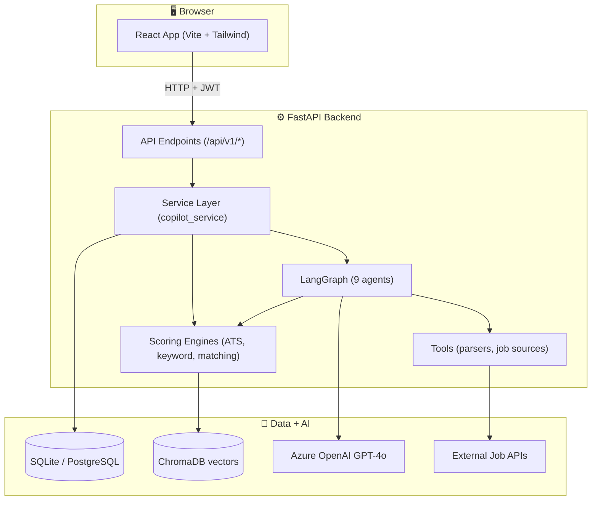
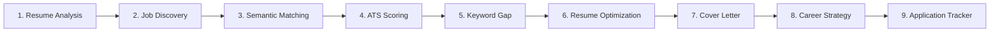

# 🎓 TalentTrail — The Complete Learning Guide (Reverse-Engineering Edition)

> Read this top-to-bottom and you will understand **every file, every technology, and every data flow** in this project. It is written for someone who wants to *learn the whole thing*, not just use it.

---

## Table of Contents

1. [How to use this guide](#1-how-to-use-this-guide)
2. [The 60-second mental model](#2-the-60-second-mental-model)
3. [The technology stack — what & why](#3-the-technology-stack--what--why)
4. [The big-picture architecture](#4-the-big-picture-architecture)
5. [Folder-by-folder map](#5-folder-by-folder-map)
6. [Backend deep dive (layer by layer)](#6-backend-deep-dive-layer-by-layer)
7. [The 9 agents & LangGraph explained](#7-the-9-agents--langgraph-explained)
8. [The scoring engines (the "brains")](#8-the-scoring-engines-the-brains)
9. [Frontend deep dive](#9-frontend-deep-dive)
10. [Three end-to-end traces (the reverse-engineering core)](#10-three-end-to-end-traces)
11. [Cross-cutting concepts](#11-cross-cutting-concepts)
12. [Suggested study order (a 7-day plan)](#12-suggested-study-order)
13. [Hands-on exercises](#13-hands-on-exercises)
14. [Glossary](#14-glossary)

---

## 1. How to use this guide

This is a **reverse-engineering** guide: instead of reading code randomly, you'll learn by following **how a real request flows** through the system. Three rules:

1. **Keep the repo open beside this doc.** Every file path is a clickable reference.
2. **Follow the traces in Section 10.** They connect everything together.
3. **Do the exercises in Section 13.** You only truly learn by changing code and watching it break/work.

---

## 2. The 60-second mental model

The app is **"Cursor for Job Hunting"** — an autonomous assistant that takes your resume and a job, then does everything a career coach would: find jobs, score how well you fit, find your gaps, rewrite your resume, write a cover letter, and plan your growth.

The killer idea is **multi-agent orchestration**: instead of one giant function, the work is split into **9 specialized "agents"** that run in sequence, each doing one job and passing its results to the next. This is coordinated by **LangGraph** (a state-machine library for LLM apps).

```
Resume + Job  →  [9 AI agents in a pipeline]  →  Scores, rewrites, letters, roadmap
```

There are **two ways** the same logic gets used:
- **Autopilot** = run the entire 9-agent graph end-to-end (one click).
- **AI Assistant / individual pages** = call one agent's logic at a time (ATS page, Keyword page, etc.) through the **service layer**.

---

## 3. The technology stack — what & why

### Backend

| Technology | What it is | Why this project uses it |
|---|---|---|
| **Python 3.12** | Language | Best ecosystem for AI/LLM tooling |
| **FastAPI** | Web framework | Async, auto-generates OpenAPI docs, Pydantic validation built-in |
| **LangGraph** | Agent orchestration | Builds the 9-agent pipeline as a **state graph** (nodes + edges) |
| **LangChain** | LLM abstraction | Provider-agnostic chat/embeddings interface |
| **Azure OpenAI (GPT-4o)** | The LLM | Does the "thinking" — parsing resumes, writing letters |
| **Pydantic v2 + pydantic-settings** | Validation & config | Typed request/response models + typed env config |
| **SQLAlchemy 2.0** | ORM | Maps Python classes ↔ DB tables; works on SQLite & Postgres |
| **SQLite / PostgreSQL** | Database | SQLite for dev (zero setup), Postgres for production |
| **ChromaDB** | Vector database | Stores embeddings for semantic search |
| **python-jose + passlib/bcrypt** | Auth | JWT tokens + password hashing |
| **slowapi** | Rate limiting | Protects API from abuse |
| **structlog** | Logging | Structured JSON logs in prod, pretty logs in dev |
| **httpx** | HTTP client | Calls external job APIs + LLM (with SSL control) |
| **pypdf / python-docx** | Document parsing | Extracts text from uploaded resumes |
| **pytest** | Testing | 13 deterministic tests, no network needed |

### Frontend

| Technology | What it is | Why |
|---|---|---|
| **React 18** | UI library | Component-based UI |
| **Vite** | Build tool | Instant dev server + fast production builds |
| **React Router v6** | Routing | Client-side navigation between pages |
| **Tailwind CSS** | Styling | Utility-first CSS, dark mode support |
| **Axios** | HTTP client | Talks to the backend API, injects JWT |
| **Recharts** | Charts | Dashboard analytics visualizations |
| **lucide-react** | Icons | Clean SVG icon set |

### DevOps

| Technology | Why |
|---|---|
| **Docker + Docker Compose** | Package the whole stack (db + backend + frontend) to run anywhere |
| **nginx** | Serves the built React app + proxies `/api` to backend |
| **GitHub Actions** | CI (tests on every push) + CD (deploy to AWS) |

---

## 4. The big-picture architecture



**The golden rule of this architecture:** dependencies point *inward and downward*.
`API → Service → (Agents/Engines/Tools) → Data`. Endpoints never touch the database directly; agents never touch HTTP. This is **clean / layered architecture** and it's what makes the code testable.

---

## 5. Folder-by-folder map

```
talenttrail/
├── backend/
│   ├── app/
│   │   ├── main.py                ← FastAPI app entry (middleware, CORS, startup)
│   │   ├── schemas.py             ← Pydantic request/response models (the API contract)
│   │   ├── core/                  ← Cross-cutting infra
│   │   │   ├── config.py          ← Typed settings from .env
│   │   │   ├── llm.py             ← LLM + embeddings factory (Azure/Ollama/fallback)
│   │   │   ├── security.py        ← JWT + password hashing
│   │   │   └── logging.py         ← structlog setup
│   │   ├── db/
│   │   │   ├── models.py          ← SQLAlchemy ORM tables
│   │   │   ├── session.py         ← DB engine + session factory
│   │   │   └── init_db.py         ← Create tables + seed demo data
│   │   ├── agents/                ← The 9 LangGraph agents + orchestration
│   │   │   ├── state.py           ← Shared state (TypedDict) passed between agents
│   │   │   ├── base.py            ← @track decorator + llm_json/llm_text helpers
│   │   │   ├── graph.py           ← Wires agents into a graph (THE pipeline)
│   │   │   └── *_agent.py         ← One file per agent (9 total)
│   │   ├── tools/                 ← Deterministic logic (no graph dependency)
│   │   │   ├── text_utils.py      ← Tokenizing, skills, jaccard, cosine, coverage
│   │   │   ├── ats_engine.py      ← ATS scoring math
│   │   │   ├── keyword_engine.py  ← Missing-keyword analysis
│   │   │   ├── matching_engine.py ← 4-stage job ranking
│   │   │   ├── job_skills.py      ← LLM-based job requirement extraction
│   │   │   ├── job_sources.py     ← Job provider abstraction + aggregation
│   │   │   ├── live_job_sources.py← Real API adapters (Google Jobs, Remotive…)
│   │   │   └── document_parser.py ← PDF/DOCX → text
│   │   ├── services/
│   │   │   ├── copilot_service.py ← Orchestrates agents + persistence (the hub)
│   │   │   └── analytics_service.py← Dashboard metrics
│   │   ├── api/
│   │   │   ├── deps.py            ← get_current_user, get_db dependencies
│   │   │   └── v1/
│   │   │       ├── router.py      ← Combines all endpoint routers
│   │   │       └── endpoints/     ← auth, resume, jobs, analysis, applications, insights
│   │   └── vector/store.py        ← ChromaDB wrapper
│   ├── tests/                     ← pytest suite
│   ├── requirements.txt
│   ├── Dockerfile
│   └── run-local.sh               ← Local dev launcher (SQLite override)
├── frontend/
│   ├── src/
│   │   ├── main.jsx               ← React entry (Router + AuthProvider)
│   │   ├── App.jsx                ← Routes + app shell (Navbar + Sidebar)
│   │   ├── lib/api.js             ← Axios client (all backend calls live here)
│   │   ├── context/AuthContext.jsx← Login state + JWT handling
│   │   ├── pages/                 ← One file per screen (12 pages)
│   │   └── components/            ← Reusable UI (cards, board, charts, nav)
│   ├── nginx.conf                 ← Production serving + /api proxy
│   └── Dockerfile
├── docker-compose.yml             ← Local 3-container stack
├── docker-compose.aws.yml         ← AWS production overrides
└── .github/workflows/             ← CI (ci.yml) + CD (deploy.yml)
```

---

## 6. Backend deep dive (layer by layer)

We go **bottom-up**: config → data → tools → agents → services → API. This is the order in which dependencies are built.

### 6.1 Configuration — `core/config.py`

Everything starts here. `Settings` is a **pydantic-settings** class that reads `.env` and gives you a **typed, validated** config object.

```python
class Settings(BaseSettings):
    LLM_PROVIDER: Literal["azure", "ollama"] = "azure"
    DATABASE_URL: str = "sqlite:///./talenttrail.db"
    SECRET_KEY: str = "change-me"
    ...
settings = get_settings()   # @lru_cache → parsed once per process
```

**Why this matters:** no file in the codebase reads `os.environ` directly. They all `from app.core.config import settings`. This means config is testable (you can override it) and self-documenting (every option is listed with a type and default).

**Learn this concept:** *centralized typed configuration*. The `@lru_cache` makes `get_settings()` a singleton.

### 6.2 The LLM factory — `core/llm.py`

This is one of the **smartest files** in the project. It hides all LLM complexity behind two functions: `get_chat_model()` and `get_embeddings()`.

Three lessons packed in here:

1. **Provider abstraction.** Switch between Azure OpenAI and local Ollama with one env var. Agent code never knows which is active.
2. **SSL control.** `_http_clients()` builds httpx clients that can disable TLS verification — needed behind corporate proxies that intercept SSL. (This was the root cause of many bugs in this project's history.)
3. **Graceful degradation.** `_ResilientEmbeddings` wraps the real embedder; if the network fails, it *transparently* falls back to a local hashing embedder (`_HashingEmbeddings`) so the app never crashes. The fallback is "sticky" (once degraded, stays degraded) to avoid repeatedly paying for failing calls.

**Learn this concept:** *the Factory pattern + graceful fallback*. A function that returns the right object based on config, with a safety net.

### 6.3 Security — `core/security.py`

Pure functions, **no FastAPI imports** (so they're unit-testable). Two responsibilities:

- **Passwords:** `hash_password` / `verify_password` using bcrypt. Passwords are never stored in plaintext.
- **JWT tokens:** `create_access_token` (60 min) and `create_refresh_token` (7 days). Each token embeds `sub` (user id), `type` (access/refresh), `iat`, `exp`. `decode_token` validates signature, expiry, and type.

**Learn this concept:** *stateless authentication*. The server doesn't store sessions — the signed JWT *is* the proof of identity.

### 6.4 Data layer — `db/`

- **`session.py`** creates the SQLAlchemy `engine` and `SessionLocal` factory. The `get_db()` generator is a FastAPI **dependency** that yields a session and always closes it (try/finally). SQLite needs `check_same_thread=False` because FastAPI uses a thread pool.

- **`models.py`** defines every table as a Python class. Key tables:
  - `User` → `Resume` (1-to-many, versioned) → `Skill` / `Project`
  - `JobPosting` (with a JSON `skills` column)
  - `JobMatch` (ranking scores per user+job)
  - `ATSScore`, `KeywordAnalysis` (analysis results)
  - `Application` (the Kanban tracker, 8 statuses via an Enum)
  - `CoverLetter`, `CareerRecommendation`, `AgentRun` (pipeline run log)
  - **JSON columns** (`parsed`, `skills`, `breakdown`, `missing`) store semi-structured LLM output so the schema stays stable while AI output evolves.
  - `TimestampMixin` adds `created_at`/`updated_at` to every table.

- **`init_db.py`** runs on startup: `Base.metadata.create_all()` creates tables, then `_seed()` inserts the demo user (`demo@talenttrail.dev` / `demo1234`) and two sample jobs — so a fresh clone has data immediately.

**Learn this concept:** *ORM + dependency-injected sessions*. You write Python, SQLAlchemy writes SQL. The `get_db` dependency guarantees no leaked connections.

### 6.5 Schemas — `schemas.py`

These are **Pydantic v2** models — the *boundary contract*. ORM models are internal; schemas are what the API speaks. They:
- Validate incoming JSON (e.g. `UserCreate` enforces password length 8–128).
- Shape outgoing JSON (e.g. `ATSResult` lists exactly the fields the UI needs).
- `ORMModel` with `from_attributes=True` lets a SQLAlchemy object be returned directly and auto-serialized.

**Learn this concept:** *separation of internal models from API contracts*. Changing a DB column doesn't automatically change your public API.

---

## 7. The 9 agents & LangGraph explained

This is the heart of the project. Read this section slowly.

### 7.1 What is an "agent" here?

An agent is just a **Python function** that:
- takes the whole shared `state` (a dict),
- does one job (maybe calling the LLM),
- returns a **partial** dict that LangGraph merges back into the state.

```python
@track("resume_analysis")
def resume_analysis_node(state: TalentTrailState) -> dict:
    ...
    return {"resume_data": parsed}   # ← partial update merged into state
```

### 7.2 The shared state — `agents/state.py`

`TalentTrailState` is a `TypedDict` listing every field an agent might read or write (`resume_data`, `jobs_found`, `ranked_jobs`, `ats_scores`, …).

Two fields are special:
```python
execution_history: Annotated[list[dict], add]
errors: Annotated[list[dict], add]
```
The `Annotated[..., add]` is a **reducer**: instead of overwriting, LangGraph *concatenates* these lists. That's how every agent can append its own trace entry and you get a full execution history for free.

**Learn this concept:** *shared mutable state with reducers*. Most fields overwrite; reducer fields accumulate.

### 7.3 The base helpers — `agents/base.py`

Two reusable pieces every agent leans on:

1. **`@track(name)` decorator** — wraps a node to: time it, log it, append `{agent, status, ms}` to `execution_history`, and **catch exceptions** so one failing agent doesn't crash the whole graph (it records the error and continues).

2. **`llm_json()` / `llm_text()`** — call the LLM and:
   - `llm_json` extracts JSON from the response (even if wrapped in ```` ```json ```` fences) and returns a `fallback` value on any failure.
   - This is why agents *never crash* on bad LLM output — there's always a deterministic fallback.

**Learn this concept:** *resilience via decorators + fallbacks*. The graph keeps running no matter what.

### 7.4 The graph — `agents/graph.py`

This wires the agents into a pipeline:

```python
g.add_node("resume_analysis", resume_analysis_node)
g.add_node("job_discovery", job_discovery_node)
...
g.add_edge("resume_analysis", "job_discovery")
g.add_edge("job_discovery", "semantic_matching")
g.add_edge("semantic_matching", "ats_scoring")
g.add_edge("ats_scoring", "keyword_gap")        # ← node name ≠ state key!
g.add_edge("keyword_gap", "resume_optimization")
...
```

> **A real bug fixed in this project:** the node was originally named `missing_keywords` — the *same* as a state key. LangGraph forbids that (a node can't share a name with a state channel). It was renamed to `keyword_gap` while the agent's `@track("missing_keywords")` label stayed the same so the UI timeline still matches.

There are **two graphs**:
- `build_graph()` — the full 9-agent pipeline (Autopilot).
- `build_analysis_graph()` — a lean 4-node graph (ATS → keyword → optimize → cover) for single-job flows.

Both are `@lru_cache`d so the graph is compiled once.

### 7.5 The 9 agents in order



| # | Agent | File | What it does | LLM? |
|---|---|---|---|---|
| 1 | **Resume Analysis** | `resume_agent.py` | Raw resume text → structured JSON (skills, projects, education). Backstops with deterministic skill extraction so it's never empty. | ✅ + fallback |
| 2 | **Job Discovery** | `job_discovery_agent.py` | Searches job sources, dedupes, categorizes (ai_ml/frontend/backend…). | ❌ |
| 3 | **Semantic Matching** | `matching_agent.py` | Ranks jobs vs resume using the 4-stage engine. | ✅ (embeddings) |
| 4 | **ATS Scoring** | `ats_agent.py` | Explainable 0–100 fit score for the target job. | ❌ (pure math) |
| 5 | **Keyword Gap** | `keyword_agent.py` | Categorized missing keywords (skills/tools/frameworks). | ❌ |
| 6 | **Resume Optimization** | `optimization_agent.py` | Rewrites bullets/summary, ATS-friendly, no fabrication. | ✅ + fallback |
| 7 | **Cover Letter** | `cover_letter_agent.py` | Tone-adapted letter (startup/FAANG/enterprise/AI). | ✅ + fallback |
| 8 | **Career Strategy** | `strategy_agent.py` | 30/60/90-day roadmap, skills to learn, projects. | ✅ + fallback |
| 9 | **Application Tracker** | `tracker_agent.py` | Funnel analytics (interview rate, offer rate). | ❌ |

**Notice the pattern:** LLM agents do *judgment* (parse, write, plan). Non-LLM agents do *math* (score, rank, count). The math is deterministic and unit-tested; the LLM parts always have fallbacks.

### 7.6 A subtle but important detail: `_resolve_target`

Agents 4–7 need to know *which job* to analyze. They share `_resolve_target(state)` (defined in `ats_agent.py`):
1. Use `target_job_id` if set, else
2. The top-ranked job, else
3. The first job found.

This is why both the full pipeline and single-job flows work with the same agent code.

---

## 8. The scoring engines (the "brains")

These live in `tools/` and contain **zero LLM calls** — pure, deterministic, testable math. This is what makes the scores *explainable* and *reproducible*.

### 8.1 `text_utils.py` — the foundation

The toolbox everything else uses:
- `tokenize()` — split text into lowercase word tokens.
- `SKILL_LEXICON` — ~180 known skills + `_SKILL_ALIASES` (e.g. "nodejs" → "node.js").
- `extract_skills()` — find lexicon skills in text (handles multi-word + aliases).
- `normalize_skills()` — clean & canonicalize a skill list.
- **`coverage(have, required)`** — fraction of *required* items you have. **This is the key ATS metric.**
- `jaccard(a, b)` — overlap / union (used for keyword similarity).
- `cosine(v1, v2)` — vector similarity (used for semantic matching).
- `keyword_density()` — fraction of job keywords present in the resume.

> **Coverage vs Jaccard — a critical lesson.** ATS skill match uses `coverage`, NOT `jaccard`. Why? Jaccard penalizes breadth: a resume with 52 skills vs a job needing 5 would score low even if it has all 5 (because the union is huge). Coverage asks the *right* question: "what fraction of the job's requirements does the candidate meet?" This subtle choice was a real fix in the project's history.

### 8.2 `ats_engine.py` — explainable scoring

```
total = 0.40·skills + 0.20·projects + 0.20·experience + 0.10·education + 0.10·keyword_density
```

Each sub-score is 0–1, weights are configurable (`ATSWeights`), and the result includes a `detail` dict with `matched_skills` and `missing_skills` for the UI. `score()` accepts explicit `job_skills`/`resume_skills` (the rich LLM-extracted sets) or falls back to lexicon extraction.

- `_experience_match` parses "N years" from the JD and compares to the candidate's years.
- `_education_match` ranks degree levels (high school < bachelor < master < phd).

**Learn this concept:** *explainable scoring*. Not a black box — every number is traceable to a formula.

### 8.3 `keyword_engine.py` — gap analysis

`analyze()` compares resume skills vs job skills, returns:
- `present` — skills you have that the job wants.
- `missing` — categorized into skills / technologies / frameworks / tools, ranked by frequency in the JD (importance proxy).

### 8.4 `matching_engine.py` — 4-stage ranking

```
final = 0.25·keyword + 0.35·semantic + 0.25·ats + 0.15·recency
```
- **keyword** — Jaccard over content words.
- **semantic** — cosine over embeddings (this is where ChromaDB/embeddings shine).
- **ats** — reuses the ATS engine.
- **recency** — exponential decay (fresh jobs score higher, 14-day half-life).

Every result carries an `explanation` ("Strongest signal: semantic…") for the "explainable ranking" UI.

### 8.5 `job_skills.py` — bridging LLM + math

This is the clever connector: real job descriptions phrase requirements in prose, so `extract_job_skills()` uses the **LLM** to read a JD and return clean skills, then **caches** them on `JobPosting.skills`. The math engines then consume that clean list. `skills_for_job()` is the in-pipeline version.

**Learn this concept:** *use the LLM where language is messy, use math where you need determinism, and cache the bridge between them.*

---

## 9. Frontend deep dive

### 9.1 Entry & routing

- **`main.jsx`** wraps the app in `<BrowserRouter>` (routing) and `<AuthProvider>` (login state).
- **`App.jsx`** defines routes. Protected routes are wrapped in `<Protected>` (redirects to `/login` if not authenticated) and `<Shell>` (Navbar + Sidebar + content area).

### 9.2 The API client — `lib/api.js`

**Every** backend call lives here. Key patterns:
- An Axios instance with `baseURL` from `VITE_API_BASE_URL`.
- A **request interceptor** that injects the JWT (`Authorization: Bearer …`) on every call.
- A **response interceptor** that, on a 401, clears the token and redirects to login.
- A flat `api` object: `api.login()`, `api.atsScore()`, `api.runPipeline()`, etc.

**Learn this concept:** *centralized API client*. Components never build URLs or handle tokens — they call `api.something()`.

### 9.3 Auth state — `context/AuthContext.jsx`

React Context holding `user`, `login`, `register`, `logout`. On mount, if a token exists, it calls `api.me()` to restore the session. This is how the app "remembers" you're logged in after a refresh.

### 9.4 Pages (12 screens)

| Page | Calls | Purpose |
|---|---|---|
| `Login` | `api.login/register` | Auth |
| `Copilot` | upload → search → ats/keywords → optimize/cover → apply | Guided 5-step flow |
| `AutoCopilot` | `api.runPipeline` | One-click full 9-agent run with live agent timeline |
| `Dashboard` | `api.analytics` | Stat tiles + Recharts |
| `ResumeUpload` | `api.uploadResume/analyzeResume` | Upload + parse |
| `JobSearch` | `api.searchJobs` | Search + save jobs |
| `Recommendations` | `api.recommendations` | Ranked matches |
| `ATSAnalysis` | `api.atsScore` | ATS card (falls back to `allJobs` if no recs) |
| `KeywordGap` | `api.keywords` | Gap table |
| `CoverLetter` | `api.coverLetter` | Letter generator |
| `Tracker` | `ApplicationBoard` | Kanban drag-and-drop |
| `Roadmap` | `api.roadmap` | 30/60/90 plan |

### 9.5 Key components

- **`ATSScoreCard`** — verdict banner (Strong/Moderate/Needs work), radial gauge, factor bars, "working in your favor" vs "fix these first".
- **`KeywordGapTable`** — coverage %, "add these first" priorities, present/missing breakdown.
- **`ApplicationBoard`** — 8-column Kanban with HTML5 drag-and-drop + optimistic updates + a manual "Add job" modal.
- **`AnalyticsCharts`** — 4 Recharts visualizations with a `useDarkMode` hook so chart colors adapt.

---

## 10. Three end-to-end traces

**This is the most important section.** Follow each arrow with the files open.

### Trace A — "I upload my resume"

```
1. ResumeUpload.jsx          → api.uploadResume(file)
2. lib/api.js                → POST /api/v1/resume/upload  (JWT injected)
3. endpoints/resume.py       → upload_resume()  validates type/size
4. copilot_service.py        → create_resume_from_upload()
5. document_parser.py        → extract_text()  PDF/DOCX → clean text
6. (back in service)         → saves Resume row (raw_text), deactivates old version
7. ResumeUpload.jsx          → api.analyzeResume(id)
8. endpoints/resume.py       → analyze_resume()
9. copilot_service.py        → analyze_resume() runs resume_analysis_node
10. resume_agent.py          → llm_json() → structured JSON; tu.extract_skills fallback
11. (service)                → saves parsed JSON, Skill rows, Project rows
12. UI                       → shows parsed summary + skills
```
**What you learn:** the full vertical slice — page → api → endpoint → service → tool → agent → db → back to UI.

### Trace B — "Score my ATS fit" (single-job flow)

```
1. ATSAnalysis.jsx           → api.atsScore(resumeId, jobId)
2. POST /api/v1/ats/score    → endpoints/analysis.py → svc.compute_ats()
3. copilot_service.py        → _resolve_job_skills(job):
                                 if job.skills empty → job_skills.extract_job_skills()
                                 → LLM reads JD → clean skills → CACHED on job.skills
4. copilot_service.py        → _resume_skill_set(resume): LLM skills ∪ lexicon skills
5. ats_engine.score(job_skills=…, resume_skills=…)
                              → coverage(resume, job) for skills_match
                              → projects/experience/education/keyword_density
                              → weighted total + matched/missing detail
6. (service)                 → persists ATSScore row, returns dict
7. ATSScoreCard.jsx          → renders gauge + factors + missing skills
```
**What you learn:** how the LLM (messy language) and math engines (determinism) combine, and why skills are cached.

### Trace C — "Run Autopilot" (full pipeline)

```
1. AutoCopilot.jsx           → api.runPipeline(query, location)   [180s timeout]
2. POST /api/v1/pipeline/run → insights.py → svc.run_full_pipeline()
3. copilot_service.py        → creates AgentRun(status=running)
                              → build_graph().invoke(new_state(...))
4. LangGraph runs all 9 nodes in sequence, each merging its update into state:
     resume_analysis → job_discovery → semantic_matching → ats_scoring
     → keyword_gap → resume_optimization → cover_letter → career_strategy
     → application_tracker
5. Each node appends to execution_history (reducer = list concat)
6. (service)                 → AgentRun.status = completed, saves history
7. AutoCopilot.jsx           → animates the agent timeline, shows ATS card,
                                keyword gap, optimized resume, cover letter, roadmap
```
**What you learn:** how LangGraph orchestrates a multi-step AI workflow and how the state accumulates results.

---

## 11. Cross-cutting concepts

These ideas appear *everywhere* — master them and the codebase clicks.

1. **Layered (clean) architecture.** API → Service → Agents/Engines/Tools → Data. Each layer only knows the one below it.
2. **Dependency injection.** FastAPI's `Depends(get_db)` and `Depends(get_current_user)` inject what an endpoint needs.
3. **Graceful degradation.** LLM fails → deterministic fallback. Embeddings fail → hashing embedder. Live jobs fail → mock providers. The app *never* hard-crashes.
4. **Determinism where it counts.** Scores are math, not LLM, so they're reproducible and testable.
5. **The LLM-as-enricher pattern.** LLM extracts/writes; math scores. The `job_skills.py` bridge caches the LLM output so you pay once.
6. **Stateless auth.** JWT carries identity; no server-side sessions.
7. **Observability for free.** The `@track` decorator + reducer state = a complete execution trace with no extra code.
8. **Config as code.** One typed `Settings` object; no scattered `os.environ`.

---

## 12. Suggested study order

A realistic 7-day plan. Each day, *read the files, then run the relevant exercise from Section 13.*

| Day | Focus | Files |
|---|---|---|
| **1** | Foundations & config | `core/config.py`, `core/logging.py`, `db/session.py`, `db/models.py`, `db/init_db.py` |
| **2** | Auth & API skeleton | `core/security.py`, `api/deps.py`, `endpoints/auth.py`, `main.py`, `schemas.py` |
| **3** | The deterministic engines | `tools/text_utils.py`, `tools/ats_engine.py`, `tools/keyword_engine.py`, `tools/matching_engine.py` + run `pytest tests/test_engines.py` |
| **4** | Tools & data sources | `tools/document_parser.py`, `tools/job_sources.py`, `tools/live_job_sources.py`, `tools/job_skills.py`, `vector/store.py` |
| **5** | Agents & LangGraph | `agents/state.py`, `agents/base.py`, all 9 `*_agent.py`, `agents/graph.py` |
| **6** | Services & endpoints | `services/copilot_service.py`, `services/analytics_service.py`, all `endpoints/*.py` |
| **7** | Frontend | `main.jsx`, `App.jsx`, `lib/api.js`, `context/AuthContext.jsx`, then pages + components |

---

## 13. Hands-on exercises

Do these in order. They force you to understand by changing things.

**Beginner**
1. **Add a skill.** Add `"rust"` aliases or a new skill to `SKILL_LEXICON` in `text_utils.py`. Re-run `pytest tests/test_engines.py`. Watch extraction pick it up.
2. **Change ATS weights.** In `ats_engine.py`, bump `skills` to 0.50 and drop `keyword_density` to 0.0. Score a job and see the total change.
3. **Reword a button.** Change a label in `Dashboard.jsx`, run `npm run dev`, see hot-reload.

**Intermediate**
4. **Trace a request with logs.** Add a `logger.info("my.debug", job_id=job.id)` in `compute_ats` and watch it appear when you hit the ATS page.
5. **Add an endpoint.** Create `GET /jobs/count` returning the number of stored jobs. Wire it in `endpoints/jobs.py`, add `api.jobCount()` in `lib/api.js`, show it on the Dashboard.
6. **Inspect the graph state.** In `run_full_pipeline`, print `final.keys()` to see everything the 9 agents produced.

**Advanced**
7. **Write a new agent.** Add a 10th agent (e.g. "salary_estimator") — create `salary_agent.py` with `@track`, add it to `graph.py` with edges, add a state field. Run the pipeline.
8. **Swap the LLM provider.** Set `LLM_PROVIDER=ollama` in `.env`, install Ollama, and watch the same agents run on a local model — no agent code changes.
9. **Add a test.** Write a `pytest` for your new endpoint in `tests/test_api.py`.

---

## 14. Glossary

| Term | Meaning |
|---|---|
| **Agent** | A Python function that does one step of the pipeline and returns a state update |
| **LangGraph** | Library that runs agents as a state machine (nodes + edges) |
| **State** | The shared dict passed between agents (`TalentTrailState`) |
| **Reducer** | A rule for merging state (here: `add` = list concat for history/errors) |
| **Node / Edge** | A node is an agent; an edge defines run order |
| **Embedding** | A list of numbers representing text meaning; similar text → similar vectors |
| **Cosine similarity** | Measures how aligned two embedding vectors are (0–1) |
| **Jaccard** | overlap ÷ union of two sets |
| **Coverage** | fraction of *required* items you have (the ATS metric) |
| **ATS** | Applicant Tracking System — software that screens resumes by keywords |
| **ORM** | Object-Relational Mapper — Python classes ↔ DB tables (SQLAlchemy) |
| **JWT** | JSON Web Token — a signed token proving who you are |
| **Dependency injection** | Framework supplies what a function needs (`Depends(...)`) |
| **Service layer** | Business-logic layer between endpoints and data |
| **Pydantic schema** | Typed model validating/serializing API data |
| **Factory** | A function that builds the right object based on config (`get_chat_model`) |
| **Graceful degradation** | Falling back to a simpler path instead of crashing |
| **Vite** | Fast frontend build tool / dev server |
| **Tailwind** | Utility-first CSS framework |

---

## Final word

The single most important thing to internalize: **this project separates *judgment* (LLM) from *calculation* (deterministic engines), wires the judgment steps together with LangGraph, and keeps every layer independently testable.** Once you see that pattern, every file has an obvious place and purpose.

Start with **Section 10's traces**, keep the files open, and do the exercises. You'll know the whole system within a week.
