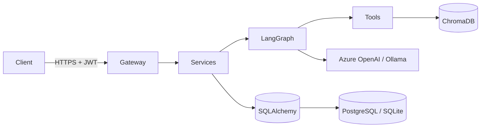
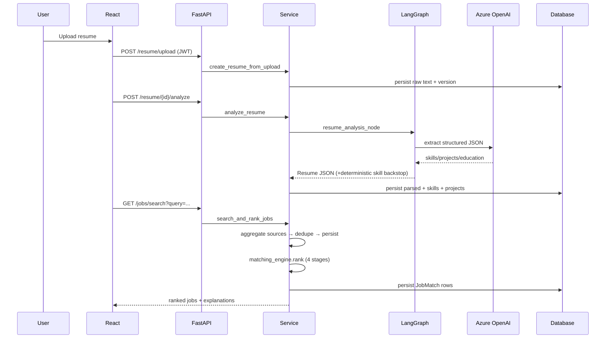
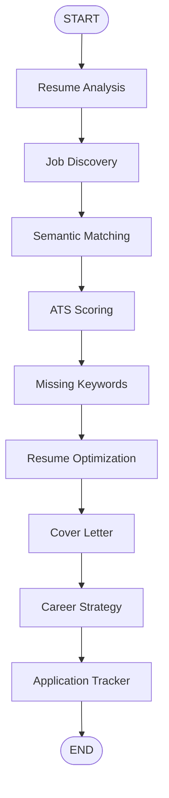

# System Design — TalentTrail

## 1. Overview

TalentTrail is a layered, multi-agent SaaS application. The design goals:

- **Provider-agnostic AI** — swap Azure OpenAI ↔ Ollama via one env var.
- **Explainability** — every score (ATS, ranking) ships with a transparent breakdown.
- **Resilience** — each LLM call has a deterministic fallback, so the pipeline never hard-fails.
- **Clean architecture** — endpoints → services → tools/agents → data, with the DB touched only in the service/repository layer.

## 2. Layered architecture

| Layer | Responsibility | Key modules |
| --- | --- | --- |
| Frontend | UI, auth state, API calls | `frontend/src` |
| API Gateway | HTTP, validation, authz, rate limit | `app/api`, `app/main.py` |
| Agent Layer | LangGraph orchestration | `app/agents` |
| Tool Layer | Deterministic engines | `app/tools` |
| Data Layer | Persistence | `app/db`, `app/vector` |
| LLM Layer | Chat + embeddings factory | `app/core/llm.py` |

## 3. Component diagram



## 4. Request lifecycle (resume → recommendations)



## 5. Full agent pipeline



## 6. Job matching engine

```
final = 0.25·keyword + 0.35·semantic + 0.25·ats + 0.15·recency
```

- **Keyword** — Jaccard over content keywords (curated skill lexicon + content words).
- **Semantic** — cosine over embeddings (Azure embeddings or deterministic fallback).
- **ATS** — full ATS engine normalised to 0..1.
- **Recency** — exponential decay (14-day half-life).

Weights are a dataclass (`MatchWeights`) → configurable per deployment / A-B test.

## 7. ATS scoring engine

```
total = 0.40·skills + 0.20·projects + 0.20·experience + 0.10·education + 0.10·keyword_density
```

Each sub-score ∈ [0,1]; output includes matched/missing skills + the weights used, powering the "Explainable ATS" UI card.

## 8. Security

- **AuthN/Z** — JWT access (60 min) + refresh (7 d); `get_current_user` dependency guards every protected route; resources are user-scoped in queries.
- **Rate limiting** — slowapi, 120 req/min/IP default.
- **Input validation** — Pydantic v2 schemas validate every request body; upload endpoint checks extension + size + non-empty.
- **OWASP** — parameterised ORM (no SQLi), CORS allow-list, secrets via env, non-root container, no secret logging.
- **Prompt-injection** — agent system prompts constrain output to JSON and forbid fabricating experience; tool outputs are treated as data, not instructions.

## 9. Observability

- Structured logs (`structlog`) — JSON in prod, pretty in dev.
- Every agent node is wrapped by `track()` → appends `{agent, status, ms}` to `execution_history`.
- `AgentRun` table stores one row per pipeline execution for replay/debugging.
- LangSmith tracing is env-toggleable.

## 10. Scaling path

- Stateless API → horizontal scale behind a load balancer.
- Move job discovery + pipeline to a task queue (Celery/RQ) for long runs.
- Swap local uploads for S3 (interface already isolated in the service layer).
- ChromaDB → managed vector DB (Pinecone/pgvector) for multi-node.
